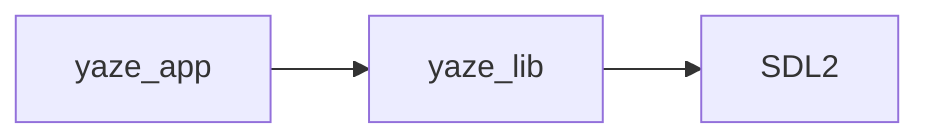

# CMake Configuration Validation

Comprehensive guide to validating CMake configuration and catching dependency issues early.

## Overview

The CMake validation toolkit provides four powerful tools to catch configuration issues before they cause build failures:

1. **validate-cmake-config.cmake** - Validates CMake cache and configuration
2. **check-include-paths.sh** - Verifies include paths in compile commands
3. **visualize-deps.py** - Generates dependency graphs
4. **test-cmake-presets.sh** - Tests all CMake presets

## Quick Start

```bash
# 1. Validate configuration after running cmake
cmake --preset mac-dbg
cmake -P scripts/validate-cmake-config.cmake build

# 2. Check include paths
./scripts/check-include-paths.sh build

# 3. Visualize dependencies
python3 scripts/visualize-deps.py build --format graphviz --stats

# 4. Test all presets for your platform
./scripts/test-cmake-presets.sh --platform mac
```

## Tool 1: validate-cmake-config.cmake

### Purpose
Validates CMake configuration by checking:
- Required targets exist
- Feature flags are consistent
- Compiler settings are correct
- Platform-specific configuration (especially Windows/Abseil)
- Output directories are created
- Common configuration issues

### Usage

```bash
# Validate default build directory
cmake -P scripts/validate-cmake-config.cmake

# Validate specific build directory
cmake -P scripts/validate-cmake-config.cmake build_ai

# Validate after configuration
cmake --preset win-ai
cmake -P scripts/validate-cmake-config.cmake build
```

### Exit Codes
- **0** - All checks passed
- **1** - Validation failed (errors detected)

### What It Checks

#### 1. Required Targets
Ensures core targets exist:
- `yaze_common` - Common interface library

#### 2. Feature Flag Consistency
- When `YAZE_ENABLE_AI` is ON, `YAZE_ENABLE_GRPC` must also be ON
- When `YAZE_ENABLE_GRPC` is ON, validates gRPC version is set

#### 3. Compiler Configuration
- C++ standard is set to 23
- MSVC runtime library is configured correctly on Windows
- Compiler flags are propagated correctly

#### 4. Abseil Configuration (Windows)
**CRITICAL for Windows builds with gRPC:**
- Checks `CMAKE_MSVC_RUNTIME_LIBRARY` is set to `MultiThreaded`
- Validates `ABSL_PROPAGATE_CXX_STD` is enabled
- Verifies Abseil include directories exist

This prevents the "Abseil missing include paths" issue.

#### 5. Output Directories
- `build/bin` exists
- `build/lib` exists

#### 6. Common Issues
- LTO enabled in Debug builds (warning)
- Missing compile_commands.json
- Generator expressions not expanded

### Example Output

```
=== CMake Configuration Validator ===
✓ Build directory: build
✓ Loaded 342 cache variables

=== Validating required targets ===
✓ Required target exists: yaze_common

=== Validating feature flags ===
✓ gRPC enabled: ON
✓ gRPC version: 1.67.1
✓ Tests enabled
✓ AI features enabled

=== Validating compiler flags ===
✓ C++ standard: 23
✓ CXX flags set: /EHsc /W4 /bigobj

=== Validating Windows/Abseil configuration ===
✓ MSVC runtime: MultiThreaded$<$<CONFIG:Debug>:Debug>
✓ Abseil CXX standard propagation enabled

=== Validation Summary ===
✓ All validation checks passed!
Configuration is ready for build
```

## Tool 2: check-include-paths.sh

### Purpose
Validates include paths in compile_commands.json to catch missing includes before compilation.

**Key Problem Solved:** On Windows, Abseil includes from gRPC were sometimes not propagated, causing build failures. This tool catches that early.

### Usage

```bash
# Check default build directory
./scripts/check-include-paths.sh

# Check specific build directory
./scripts/check-include-paths.sh build_ai

# Verbose mode (shows all include directories)
VERBOSE=1 ./scripts/check-include-paths.sh build
```

### Prerequisites

- **jq** (optional but recommended): `brew install jq` / `apt install jq`
- Without jq, uses basic grep parsing

### What It Checks

#### 1. Common Dependencies
- SDL2 includes
- ImGui includes
- yaml-cpp includes

#### 2. Platform-Specific Includes
Validates platform-specific headers based on detected OS

#### 3. Abseil Includes (Windows Critical)
When gRPC is enabled:
- Checks `build/_deps/grpc-build/third_party/abseil-cpp` exists
- Validates Abseil paths are in compile commands
- Warns about unexpanded generator expressions

#### 4. Suspicious Configurations
- No `-I` flags at all (error)
- Relative paths with `../` (warning)
- Duplicate include paths (warning)

### Exit Codes
- **0** - All checks passed or warnings only
- **1** - Critical errors detected

### Example Output

```
=== Include Path Validation ===
Build directory: build
✓ Using jq for JSON parsing

=== Common Dependencies ===
✓ SDL2 includes found
✓ ImGui includes found
⚠ yaml-cpp includes not found (may be optional)

=== Platform-Specific Includes ===
Platform: macOS
✓ SDL2 framework/library

=== Checking Abseil Includes (Windows Issue) ===
gRPC build detected - checking Abseil paths...
✓ Abseil from gRPC build: build/_deps/grpc-build/third_party/abseil-cpp

=== Suspicious Configurations ===
✓ Include flags present (234/245 commands)
✓ No duplicate include paths

=== Summary ===
Checks performed: 5
Warnings: 1
✓ All include path checks passed!
```

## Tool 3: visualize-deps.py

### Purpose
Generates visual dependency graphs and detects circular dependencies.

### Usage

```bash
# Generate GraphViz diagram (default)
python3 scripts/visualize-deps.py build

# Generate Mermaid diagram
python3 scripts/visualize-deps.py build --format mermaid -o deps.mmd

# Generate text tree
python3 scripts/visualize-deps.py build --format text

# Show statistics
python3 scripts/visualize-deps.py build --stats
```

### Output Formats

#### 1. GraphViz (DOT)
```bash
python3 scripts/visualize-deps.py build --format graphviz -o dependencies.dot

# Render to PNG
dot -Tpng dependencies.dot -o dependencies.png

# Render to SVG (better for large graphs)
dot -Tsvg dependencies.dot -o dependencies.svg
```

**Color Coding:**
- Blue boxes: Executables
- Green boxes: Libraries
- Gray boxes: Unknown type
- Red arrows: Circular dependencies

#### 2. Mermaid
```bash
python3 scripts/visualize-deps.py build --format mermaid -o dependencies.mmd
```

View at https://mermaid.live/edit or include in Markdown:

````markdown

````

#### 3. Text Tree
```bash
python3 scripts/visualize-deps.py build --format text
```

Simple text representation for quick overview.

### Circular Dependency Detection

The tool automatically detects and highlights circular dependencies:

```
✗ Found 1 circular dependencies
  libA -> libB -> libC -> libA
```

Circular dependencies in graphs are shown with red arrows.

### Statistics Output

With `--stats` flag:
```
=== Dependency Statistics ===
Total targets: 47
Total dependencies: 156
Average dependencies per target: 3.32

Most connected targets:
  yaze_lib: 23 dependencies
  yaze_app: 18 dependencies
  yaze_cli: 15 dependencies
  ...
```

## Tool 4: test-cmake-presets.sh

### Purpose
Tests that all CMake presets can configure successfully, ensuring no configuration regressions.

### Usage

```bash
# Test all presets for current platform
./scripts/test-cmake-presets.sh

# Test specific preset
./scripts/test-cmake-presets.sh --preset mac-ai

# Test only Mac presets
./scripts/test-cmake-presets.sh --platform mac

# Test in parallel (4 jobs)
./scripts/test-cmake-presets.sh --parallel 4

# Quick mode (don't clean between tests)
./scripts/test-cmake-presets.sh --quick

# Verbose output
./scripts/test-cmake-presets.sh --verbose
```

### Options

| Option | Description |
|--------|-------------|
| `--parallel N` | Test N presets in parallel (default: 4) |
| `--preset PRESET` | Test only specific preset |
| `--platform PLATFORM` | Test only presets for platform (mac/win/lin) |
| `--quick` | Skip cleaning between tests (faster) |
| `--verbose` | Show full CMake output |

### Platform Detection

Automatically skips presets for other platforms:
- On macOS: Only tests `mac-*` and generic presets
- On Linux: Only tests `lin-*` and generic presets
- On Windows: Only tests `win-*` and generic presets

### Example Output

```
=== CMake Preset Configuration Tester ===
Platform: mac
Parallel jobs: 4

Presets to test:
  - mac-dbg
  - mac-rel
  - mac-ai
  - dev
  - ci

Running tests in parallel (jobs: 4)...

✓ mac-dbg configured successfully (12s)
✓ dev configured successfully (15s)
✓ mac-rel configured successfully (11s)
✓ mac-ai configured successfully (45s)
✓ ci configured successfully (18s)

=== Test Summary ===
Total presets tested: 5
Passed: 5
Failed: 0
✓ All presets configured successfully!
```

### Failure Handling

When a preset fails:
```
✗ win-ai failed (34s)
  Log saved to: preset_test_win-ai.log

=== Test Summary ===
Total presets tested: 3
Passed: 2
Failed: 1
Failed presets:
  - win-ai

Check log files for details: preset_test_*.log
```

## Integration with CI

### Add to GitHub Actions Workflow

```yaml
name: CMake Validation

on: [push, pull_request]

jobs:
  validate-cmake:
    runs-on: ubuntu-latest
    steps:
      - uses: actions/checkout@v3

      - name: Configure CMake
        run: cmake --preset ci-linux

      - name: Validate Configuration
        run: cmake -P scripts/validate-cmake-config.cmake build

      - name: Check Include Paths
        run: ./scripts/check-include-paths.sh build

      - name: Detect Circular Dependencies
        run: python3 scripts/visualize-deps.py build --stats
```

### Pre-Configuration Check

Run validation as first CI step to fail fast:

```yaml
- name: Fast Configuration Check
  run: |
    cmake --preset minimal
    cmake -P scripts/validate-cmake-config.cmake build
```

## Common Issues and Solutions

### Issue 1: Missing Abseil Includes on Windows

**Symptom:**
```
✗ Missing required include: Abseil from gRPC build
```

**Solution:**
1. Ensure `ABSL_PROPAGATE_CXX_STD` is ON in cmake/dependencies/grpc.cmake
2. Reconfigure with `--fresh`: `cmake --preset win-ai --fresh`
3. Check that gRPC was built successfully

**Prevention:**
Run `cmake -P scripts/validate-cmake-config.cmake` after every configuration.

### Issue 2: Circular Dependencies

**Symptom:**
```
✗ Found 2 circular dependencies
  libA -> libB -> libA
```

**Solution:**
1. Visualize full graph: `python3 scripts/visualize-deps.py build --format graphviz -o deps.dot`
2. Render: `dot -Tpng deps.dot -o deps.png`
3. Identify and break cycles by:
   - Moving shared code to a new library
   - Using forward declarations instead of includes
   - Restructuring dependencies

### Issue 3: Preset Configuration Fails

**Symptom:**
```
✗ mac-ai failed (34s)
  Log saved to: preset_test_mac-ai.log
```

**Solution:**
1. Check log file: `cat preset_test_mac-ai.log`
2. Common causes:
   - Missing dependencies (gRPC build failure)
   - Incompatible compiler flags
   - Platform condition mismatch
3. Test preset manually: `cmake --preset mac-ai -B test_build -v`

### Issue 4: Generator Expressions Not Expanded

**Symptom:**
```
⚠ Generator expressions found in compile commands (may not be expanded)
```

**Solution:**
This is usually harmless. Generator expressions like `$<BUILD_INTERFACE:...>` are CMake-internal and won't appear in final compile commands. If build fails, the issue is elsewhere.

## Best Practices

### 1. Run Validation After Every Configuration

```bash
# Configure
cmake --preset mac-ai

# Validate immediately
cmake -P scripts/validate-cmake-config.cmake build
./scripts/check-include-paths.sh build
```

### 2. Test All Presets Before Committing

```bash
# Quick test of all platform presets
./scripts/test-cmake-presets.sh --platform mac --parallel 4
```

### 3. Check Dependencies When Adding New Targets

```bash
# After adding new target to CMakeLists.txt
cmake --preset dev
python3 scripts/visualize-deps.py build --stats
```

Look for:
- Unexpected high dependency counts
- New circular dependencies

### 4. Use in Git Hooks

Create `.git/hooks/pre-commit`:
```bash
#!/bin/bash
# Validate CMake configuration before commit

if [ -f "build/CMakeCache.txt" ]; then
    echo "Validating CMake configuration..."
    cmake -P scripts/validate-cmake-config.cmake build || exit 1
fi
```

### 5. Periodic Full Validation

Weekly or before releases:
```bash
# Full validation suite
./scripts/test-cmake-presets.sh --parallel 4
cmake --preset dev
cmake -P scripts/validate-cmake-config.cmake build
./scripts/check-include-paths.sh build
python3 scripts/visualize-deps.py build --format graphviz --stats -o deps.dot
```

## Troubleshooting

### Tool doesn't run on Windows

**Bash scripts:**
Use Git Bash, WSL, or MSYS2 to run `.sh` scripts.

**CMake scripts:**
Should work natively on Windows:
```powershell
cmake -P scripts\validate-cmake-config.cmake build
```

### jq not found

Install jq for better JSON parsing:
```bash
# macOS
brew install jq

# Ubuntu/Debian
sudo apt install jq

# Windows (via Chocolatey)
choco install jq
```

Scripts will work without jq but with reduced functionality.

### Python script fails

Ensure Python 3.7+ is installed:
```bash
python3 --version
```

No external dependencies required - uses only standard library.

### GraphViz rendering fails

Install GraphViz:
```bash
# macOS
brew install graphviz

# Ubuntu/Debian
sudo apt install graphviz

# Windows (via Chocolatey)
choco install graphviz
```

## Advanced Usage

### Custom Validation Rules

Edit `scripts/validate-cmake-config.cmake` to add project-specific checks:

```cmake
# Add after existing checks
log_header "Custom Project Checks"

if(DEFINED CACHE_MY_CUSTOM_FLAG)
  if(CACHE_MY_CUSTOM_FLAG)
    log_success "Custom flag enabled"
  else()
    log_error "Custom flag must be enabled for this build"
  endif()
endif()
```

### Automated Dependency Reports

Generate weekly dependency reports:

```bash
#!/bin/bash
# weekly-deps-report.sh

DATE=$(date +%Y-%m-%d)
REPORT_DIR="reports/$DATE"
mkdir -p "$REPORT_DIR"

# Configure
cmake --preset ci

# Generate all formats
python3 scripts/visualize-deps.py build \
  --format graphviz --stats -o "$REPORT_DIR/deps.dot"

python3 scripts/visualize-deps.py build \
  --format mermaid -o "$REPORT_DIR/deps.mmd"

python3 scripts/visualize-deps.py build \
  --format text -o "$REPORT_DIR/deps.txt"

# Render GraphViz
dot -Tsvg "$REPORT_DIR/deps.dot" -o "$REPORT_DIR/deps.svg"

echo "Report generated in $REPORT_DIR"
```

### CI Matrix Testing

Test all presets across platforms:

```yaml
jobs:
  test-presets:
    strategy:
      matrix:
        os: [ubuntu-latest, macos-latest, windows-latest]
    runs-on: ${{ matrix.os }}
    steps:
      - uses: actions/checkout@v3
      - name: Test Presets
        run: ./scripts/test-cmake-presets.sh --parallel 2
```

## Quick Reference

| Task | Command |
|------|---------|
| Validate config | `cmake -P scripts/validate-cmake-config.cmake build` |
| Check includes | `./scripts/check-include-paths.sh build` |
| Visualize deps | `python3 scripts/visualize-deps.py build` |
| Test all presets | `./scripts/test-cmake-presets.sh` |
| Test one preset | `./scripts/test-cmake-presets.sh --preset mac-ai` |
| Generate PNG graph | `python3 scripts/visualize-deps.py build -o d.dot && dot -Tpng d.dot -o d.png` |
| Check for cycles | `python3 scripts/visualize-deps.py build --stats` |
| Verbose include check | `VERBOSE=1 ./scripts/check-include-paths.sh build` |

## See Also

- [Build Quick Reference](../../public/build/quick-reference.md) - Build commands
- [Build Troubleshooting](../../BUILD-TROUBLESHOOTING.md) - Common build issues
- [CMakePresets.json](../../../CMakePresets.json) - All available presets
- [GitHub Actions Workflows](../../../.github/workflows/) - CI configuration
