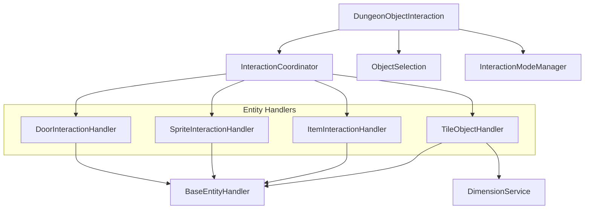
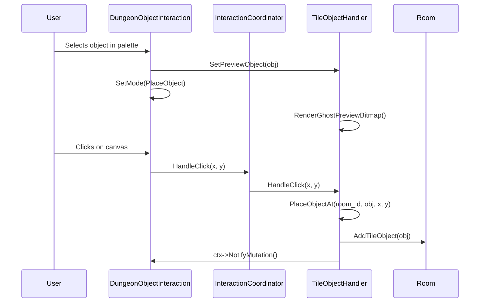
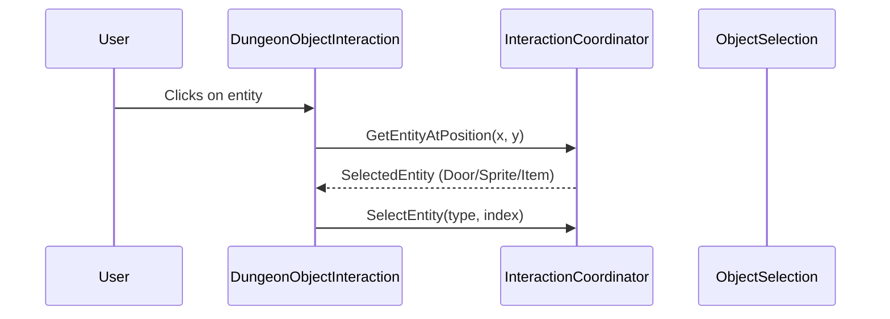

# Dungeon Interaction Architecture

**Status**: Active  
**Last Updated**: 2026-02-08  
**Related Code**: `src/app/editor/dungeon/interaction/`, `src/app/editor/dungeon/dungeon_object_interaction.{h,cc}`

## Overview

The dungeon interaction system handles all user input and entity manipulation within the dungeon canvas. It follows a **delegated handler pattern** where `DungeonObjectInteraction` acts as the main coordinator, delegating specific entity operations to specialized handlers through an `InteractionCoordinator`.

## Component Hierarchy



## Core Components

### DungeonObjectInteraction

**Location**: `src/app/editor/dungeon/dungeon_object_interaction.h`

Primary coordinator for canvas interactions. Responsibilities:
- Canvas mouse input handling (select, marquee, drag, placement)
- Tile-object selection rectangle management via `ObjectSelection`
- Delegates doors/sprites/items selection + drag + placement to `InteractionCoordinator`
- Delegates tile-object placement + mutation primitives to `TileObjectHandler`
- Snapped live dragging for tile objects (8px / 1-tile increments)
- Coordinates undo snapshots + cache invalidation via `InteractionContext` callbacks

```cpp
class DungeonObjectInteraction {
  InteractionCoordinator entity_coordinator_;
  ObjectSelection selection_;
  InteractionModeManager mode_manager_;
  // ...
};
```

### InteractionCoordinator

**Location**: `src/app/editor/dungeon/interaction/interaction_coordinator.h`

Orchestrates mode switching and dispatches to entity-specific handlers.

**Modes**:
| Mode | Description |
|------|-------------|
| `Select` | Default selection mode |
| `PlaceDoor` | Door placement active |
| `PlaceSprite` | Sprite placement active |
| `PlaceItem` | Item placement active |

**Key Methods**:
```cpp
void SetMode(Mode mode);
Mode GetCurrentMode() const;
void CancelCurrentMode();

// Entity selection
void SelectEntity(EntityType type, size_t index);
void ClearEntitySelection();
bool HasEntitySelection() const;

// Unified dispatch
bool HandleClick(int canvas_x, int canvas_y);
void DrawGhostPreviews();
void DrawSelectionHighlights();
```

### BaseEntityHandler

**Location**: `src/app/editor/dungeon/interaction/base_entity_handler.h`

Abstract interface for entity-specific handlers.

```cpp
class BaseEntityHandler {
 public:
  virtual void SetContext(InteractionContext* ctx) = 0;
  virtual void BeginPlacement() = 0;
  virtual void CancelPlacement() = 0;
  virtual bool IsPlacementActive() const = 0;
  
  virtual bool HandleClick(int canvas_x, int canvas_y) = 0;
  virtual void HandleDrag(ImVec2 current_pos, ImVec2 delta) = 0;
  virtual void HandleRelease() = 0;
  virtual bool HandleMouseWheel(float delta) { return false; }
  
  virtual void DrawGhostPreview() = 0;
  virtual void DrawSelectionHighlight() = 0;
  
  virtual std::optional<size_t> GetEntityAtPosition(int canvas_x, int canvas_y) const = 0;
};
```

### TileObjectHandler

**Location**: `src/app/editor/dungeon/interaction/tile_object_handler.h`

Handles tile object (RoomObject) manipulation.

**Mutation Operations**:
```cpp
void MoveObjects(int room_id, const std::vector<size_t>& indices, int dx, int dy);
std::vector<size_t> DuplicateObjects(int room_id, const std::vector<size_t>& indices, int dx, int dy);
void DeleteObjects(int room_id, std::vector<size_t> indices);
void ResizeObjects(int room_id, const std::vector<size_t>& indices, int delta);
void PlaceObjectAt(int room_id, const RoomObject& object, int x, int y);

// Property updates
void UpdateObjectsId(int room_id, const std::vector<size_t>& indices, int16_t new_id);
void UpdateObjectsSize(int room_id, const std::vector<size_t>& indices, uint8_t new_size);
void UpdateObjectsLayer(int room_id, const std::vector<size_t>& indices, int new_layer);

// Z-ordering
void SendToFront(int room_id, const std::vector<size_t>& indices);
void SendToBack(int room_id, const std::vector<size_t>& indices);
void MoveForward(int room_id, const std::vector<size_t>& indices);
void MoveBackward(int room_id, const std::vector<size_t>& indices);
```

**Dimension Calculations**: All bounds are calculated via `DimensionService`:
```cpp
std::pair<int, int> CalculateObjectBounds(const RoomObject& object) {
  return zelda3::DimensionService::Get().GetPixelDimensions(object);
}
```

### InteractionContext

**Location**: `src/app/editor/dungeon/interaction/interaction_context.h`

Shared state passed to all handlers.

```cpp
struct InteractionContext {
  Rom* rom = nullptr;
  gui::Canvas* canvas = nullptr;
  std::array<zelda3::Room, kRoomCount>* rooms = nullptr;
  int current_room_id = -1;
  ObjectSelection* selection = nullptr;
  gfx::PaletteGroup current_palette_group;
  
  // Callbacks
  std::function<void()> on_mutation;
  std::function<void()> on_invalidate_cache;
  std::function<void()> on_entity_changed;
  std::function<void()> on_selection_changed;
};
```

## Data Flow

### Object Placement Flow



### Entity Selection Flow



## Type Definitions

### EntityType

```cpp
enum class EntityType {
  None,
  Object,  // Tile objects (RoomObject)
  Door,
  Sprite,
  Item
};
```

### SelectedEntity

```cpp
struct SelectedEntity {
  EntityType type = EntityType::None;
  size_t index = 0;
};
```

## Interaction Modes

| Mode | Handler | Ghost Preview | Description |
|------|---------|---------------|-------------|
| Select | None | No | Default selection/drag mode |
| PlaceObject | TileObjectHandler | Yes (rendered bitmap) | Place tile objects |
| PlaceDoor | DoorInteractionHandler | Yes (rectangle) | Place doors with snapping |
| PlaceSprite | SpriteInteractionHandler | Yes (rectangle) | Place sprites |
| PlaceItem | ItemInteractionHandler | Yes (rectangle) | Place items |
| PaintCollision | N/A | Brush cursor | Collision tile painting |

## Coordinate Systems

The interaction system works with multiple coordinate systems:

| System | Unit | Range | Usage |
|--------|------|-------|-------|
| Canvas | Pixels | 0 to canvas_size × scale | Mouse input, rendering |
| Room | Tiles | 0-63 | Object positions |
| Pixel | 8px tiles | 0-511 | Dimension calculations |

**Conversion**:
```cpp
// Canvas → Room
auto [room_x, room_y] = CanvasToRoomCoordinates(canvas_x, canvas_y);

// Room → Canvas
auto [canvas_x, canvas_y] = RoomToCanvasCoordinates(room_x, room_y);
```

## Design Decisions

### Handler Delegation

Each entity type has its own handler to:
1. Encapsulate entity-specific logic (snapping, constraints)
2. Allow independent testing
3. Enable future extension without modifying core classes

### DimensionService Integration

All object dimension calculations go through `DimensionService::Get()` to:
1. Ensure consistent hit-testing across components
2. Centralize ROM-based dimension lookups
3. Support accurate selection bounds

### Mutation Notifications

All mutations trigger callbacks via `InteractionContext`:
- `on_mutation`: General change notification
- `on_invalidate_cache`: Graphics cache invalidation
- `on_entity_changed`: Entity selection changed
- `on_selection_changed`: Object selection changed

## Test Coverage

| Component | Test File | Coverage |
|-----------|-----------|----------|
| TileObjectHandler | `test/unit/editor/tile_object_handler_test.cc` | 37 tests |
| InteractionCoordinator | `test/unit/editor/interaction_coordinator_test.cc` | 18 tests |
| Interaction Delegation | `test/integration/interaction_delegation_test.cc` | 18 tests |
| ObjectSelection | `test/unit/object_selection_test.cc` | 22+ tests |

## Extension Points

### Adding a New Entity Type

1. Create handler extending `BaseEntityHandler`
2. Add member to `InteractionCoordinator`
3. Add mode to `InteractionCoordinator::Mode` enum
4. Wire handler in `SetContext()` and `CancelPlacement()`
5. Add to `GetEntityAtPosition()` dispatch

### Adding New Mutation Operations

1. Add method to `TileObjectHandler`
2. Ensure `NotifyChange(room)` is called
3. Add unit test
4. Wire to UI (keyboard shortcut or menu)
