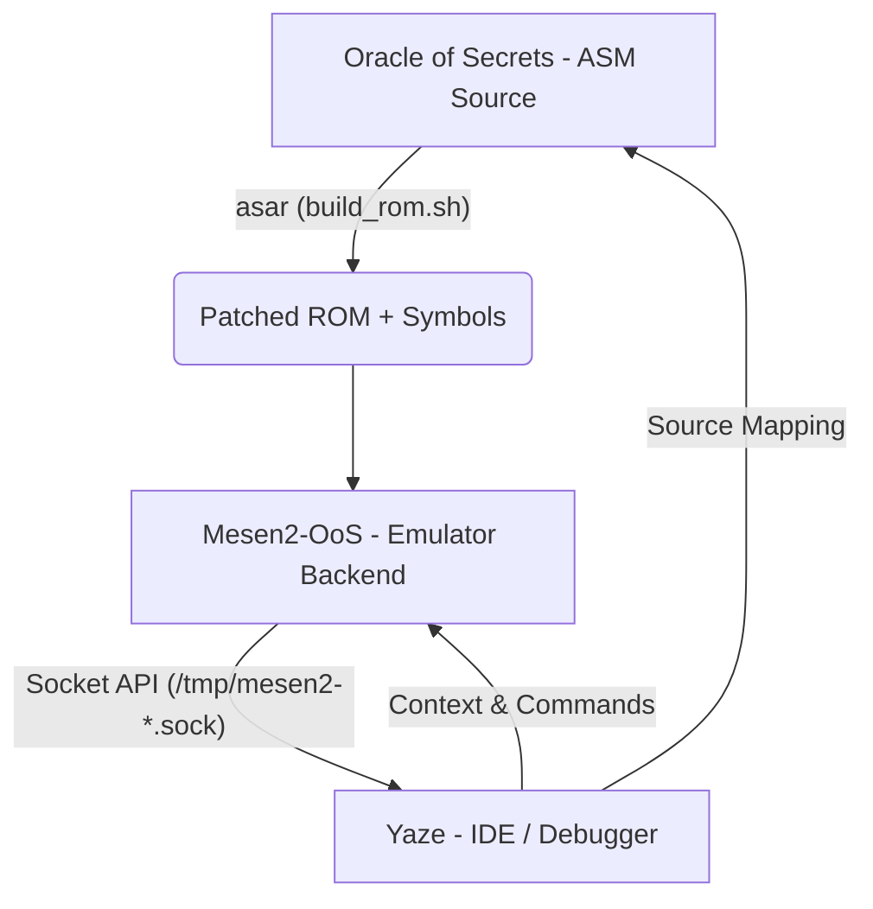

# Zelda-OoS Technical Stack & Integration Guide

This document explains the relationship between the three primary repositories used for Oracle of Secrets (OoS) development.

## The Tri-Repo Ecosystem

Modern OoS development relies on a synchronized workflow between the source code, a specialized emulator backend, and a high-level IDE.

## 1. Oracle of Secrets (OoS)
**Repository:** `scawful/Oracle-of-Secrets`
- **Role:** The target software (ROM hack).
- **Core Technology:** 65816 Assembly (ASM), `asar` assembler.
- **Key Output:** 
    - `oos168.sfc` (or `oos###.sfc`): The playable SNES ROM.
    - `oos168.symbols` (or `oos###.symbols`): WLA-style symbol file for debugger integration.

## 2. Mesen2-OoS Fork
**Repository:** `SourMesen/Mesen2` (Fork)
- **Role:** The execution environment and debugging backend.
- **Key Features:**
    - **Unix Domain Socket API:** Exposes fine-grained control (`READ`, `WRITE`, `STEP`, `PAUSE`) to external tools.
    - **Enhanced Lua API:** For overlaying agent "vision" and custom HUDs.
- **Interconnect:** Runs the patched OoS ROM. The Socket API allows Yaze and AI agents to monitor and control the game state in real-time.

## 3. YAZE (Yet Another Zelda3 Editor)
**Repository:** `scawful/yaze`
- **Role:** The modern IDE and orchestrator.
- **Key Integrations:**
    - **Mesen2 Socket Client:** Connects to the emulator via `/tmp/mesen2-[PID].sock`.
    - **Symbol Provider:** Loads `*.symbols` from the OoS project to map ROM addresses back to ASM source lines.
    - **AsmFollowService:** Prototype for syncing the editor to the current program counter (PC) in the emulator.
    - **Oracle RAM Panel:** A specialized dashboard for monitoring OoS-specific variables in real-time at 30Hz.

## Typical Development Workflow

1.  **Code:** Edit ASM files in the `Oracle-of-Secrets` repo (often via the Yaze Assembly Editor).
2.  **Build:** Run `./scripts/build_rom.sh` in the OoS repo to generate the patched ROM and symbols.
3.  **Emulate:** Load the new ROM in `Mesen2-OoS`.
4.  **Debug:** 
    - Open `Yaze` and connect to the running Mesen2 instance.
    - Use the **Oracle RAM Panel** to verify memory state.
    - Use **AsmFollow Mode** to step through new code and identify bugs.
    - Utilize the **RomDebugAgent** for AI-assisted analysis of crashes or logic errors.

## Configuration Notes

- **Socket Path:** Mesen2 creates a socket at `/tmp/mesen2-[PID].sock`. Yaze typically searches for this automatically or can be configured via project settings.
- **Presets:** Always use `*-ai` presets (e.g., `mac-ai`) when building Mesen2 and Yaze to ensure IPC and AI features are enabled.
