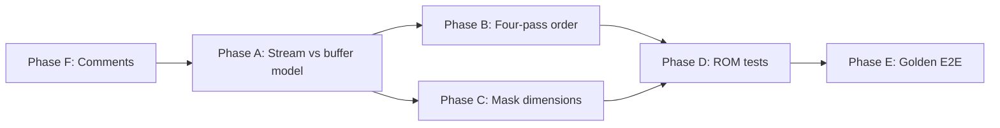

# Dungeon object rendering parity — implementation plan

**Status:** In progress  
**Created:** 2026-04-15  
**Progress (2026-04-15):** Phase A partially done — `MapRoomObjectListIndexToDrawLayer()` + documentation on `layer_`; `RoomObject::ListIndex` alias enum; parser comments fixed; `ObjectDrawer` layer comments fixed. Phase B — `Room::RenderObjectsToBackground` runs **three** `DrawObjectList` passes (primary / BG2 overlay / BG1 overlay) with `reset_chest_index` only on the first non-empty pass. Pit/mask holes use **`DimensionService::GetSelectionBoundsPixels`** (shared with selection). **Cleanup (same session):** removed ~740-line duplicate dimension `switch` (`CalculateObjectDimensions` → `DimensionService`); aligned `DimensionService` last-resort fallback with legacy drawer nibbles; `MarkBg1RectTransparent` is a proper `ObjectDrawer` member; fixed premature namespace close in `object_drawer.cc`; removed manual rectangle fallback in `Room::RenderObjectsToBackground`; deleted duplicate `dungeon_object_rendering_tests_new.cc`. Not done: ROM pixel baselines, E2E golden screenshots.  
**Primary spec:** [dungeon-object-rendering-spec.md](../agents/dungeon-object-rendering-spec.md) (USDASM `bank_01.asm`)  
**Related handoff:** [HANDOFF_BG2_MASKING_FIX.md](../hand-off/HANDOFF_BG2_MASKING_FIX.md)

## Goals

1. Match SNES room build order and layer semantics so dungeon previews align with in-game appearance.
2. Remove ambiguity between “ROM object stream index” and “SNES BG target buffer” so future changes do not regress routing.
3. Unify geometry used for masking vs selection where it affects visible holes (pits, BG2 masks).
4. Add automated tests: deterministic pixel/coverage checks where possible; golden screenshots where ROM + GPU path is required.

## Ground truth (short)

ALTTP builds dungeon graphics in multiple passes: floors, layout template, primary object list, then BG2 overlay list, then BG1 overlay list (separated by `0xFFFF` in room object data), then pushable blocks and torches. See the spec table under “Room Build & Layer Order”.

The editor currently collapses some of this; the spec’s implementation status row **Four-pass build order** is still **Not started**.

## Clarification: stream index vs `RoomObject::LayerType`

`Room::ParseObjectsFromLocation` increments a `layer` counter at each `0xFFFF` sentinel and passes it into `RoomObject::DecodeObjectFromBytes` as the last argument. That value is stored in `RoomObject::layer_`, whose type is `LayerType { BG1 = 0, BG2 = 1, BG3 = 2 }`.

**Important:** For ROM-loaded objects, the numeric values **0, 1, 2 mean object streams**, not the enum names:

| Stream counter (ROM) | Meaning (USDASM)   | Typical SNES object buffer (see spec) |
|---------------------|--------------------|----------------------------------------|
| 0                   | Primary/main list  | BG2 by default (unless routine is BothBG) |
| 1                   | BG2 overlay list   | BG2                                      |
| 2                   | BG1 overlay list   | BG1                                      |

Because stream 0 is stored as integer `0`, it collides with `LayerType::BG1` even though the main list draws to the **lower** tilemap / BG2 object path in the reference build.

`Room::RenderObjectsToBackground` therefore remaps before `ObjectDrawer::DrawObjectList`:

- `GetLayerValue() <= 1` → force `RoomObject::LayerType::BG2` for drawing  
- else → `RoomObject::LayerType::BG1`

That behavior is **consistent** with the spec line “Main list (BG2 by default, unless the routine itself writes both)”. A naive change to “layer 0 → BG1” would **break** primary-list objects unless stream indexing is modeled separately.

**Action:** Replace this implicit coupling with an explicit mapping function and types (see Phase A).

## Phase A — Model streams explicitly (routing + documentation)

**Objective:** One named conversion from “ROM stream” → “draw target layer” and no reuse of `LayerType` for stream indices on load.

**Tasks**

1. Introduce an enum, e.g. `enum class RoomObjectStream : uint8_t { kPrimary = 0, kBg2Overlay = 1, kBg1Overlay = 2 }`, or reuse a name aligned with USDASM comments.
2. Either:
   - add `RoomObject::stream_` (or `object_stream_phase_`) set at parse time and keep `layer_` for true editor/SNES target buffer, **or**
   - keep a single field but stop casting stream indices to `LayerType` in the parser; set draw target in one place.
3. Implement `RoomObject::DrawTargetLayerFromStream(RoomObjectStream s)` (or free function) documented with citations to `dungeon-object-rendering-spec.md`.
4. Fix misleading comments in `Room::ParseObjectsFromLocation` (today some lines say “Layer 0 → BG1 buffer”, which conflicts with the spec’s “main list → BG2 by default”).
5. Update `EncodeObjectToBytes` / any serialization paths so stream vs buffer stays consistent when saving.

**Validation**

- Existing integration tests that call `DrawObjectList` with `layer` 0/1/2 as **true** `LayerType` must remain valid (they do not go through `Room`’s stream remap).
- Add a small unit test: “stream kPrimary maps to BG2 draw target” and “stream kBg1Overlay maps to BG1”.

**Risk:** Editor code paths that construct `RoomObject` manually must use real `LayerType`, not stream indices. Audit call sites after introducing two concepts.

## Phase B — Four-pass build order (layout + three object streams)

**Objective:** Match USDASM ordering so layout never overdrawing BG overlays and overlay lists composite in the right order.

**Tasks**

1. Split work in `Room::RenderRoomGraphics` / `RenderObjectsToBackground` so that:
   - layout objects are drawn in their pass (already partially separate; verify against `RenderRoomGraphics` flow),
   - primary, BG2 overlay, and BG1 overlay lists are applied **in order** (either as three `DrawObjectList` calls or one list with stable ordering that matches hardware).
2. If a single combined list is kept temporarily, **sort** by stream index before draw and assert no code path reorders.
3. Align `RoomLayerManager` compositing assumptions with whatever buffers each pass writes to (object BG1 vs BG2 buffers vs layout).

**Validation**

- Unit/integration: construct a minimal room (or use ROM snippets) where an overlay must appear above a layout tile; assert pixel or priority outcome.
- Pick 1–2 vanilla rooms called out in spec or known for overlay bugs; add ROM-backed tests (Phase D).

**Risk:** Performance (multiple passes). Mitigate by batching or only splitting where order matters; profile `RenderRoomGraphics` after change.

## Phase C — Mask propagation dimensions

**Objective:** Holes punched in BG1 for pits/masks should match the same footprint the user sees in selection and in-game.

**Tasks**

1. Trace `ObjectDrawer::MarkBG1Transparent` call sites and `CalculateObjectDimensions` (or equivalent) vs `DimensionService::GetPixelDimensions` / `ObjectGeometry`.
2. Route mask rectangles through **one** helper shared with selection bounds (or document why pixel rounding differs).
3. Extend parity list for `is_pit_or_mask` if USDASM shows additional IDs; keep list centralized.

**Validation**

- Unit test: for object ID `0xA4` (and one other mask id), given fixed position/size, assert the transparent rectangle in `object_bg1_buffer_` matches expected tile bounds.

## Phase D — ROM-backed rendering tests

**Objective:** Catch regressions on real data without requiring the GUI every time.

**Tasks**

1. In `test/integration/zelda3/` (or `test/unit/zelda3/dungeon/`), add tests that:
   - load a ROM via existing `TestRomManager` patterns,
   - build selected rooms (e.g. `0x001`, `0x040`, `0x064` — adjust to rooms that actually stress overlays/masks per team knowledge),
   - call `Room::RenderRoomGraphics` (or lower-level APIs),
   - assert checksum or sparse pixel samples of composite buffer / per-layer buffers.
2. Test ordering: two objects in different streams overlapping; assert top stream wins.
3. Keep tests **stable**: fix palette/room id if ROM optional; skip or `GTEST_SKIP` when ROM missing (match existing patterns).

**Validation:** `ctest --preset mac-ai-unit` (or project’s dungeon label if split).

## Phase E — Golden screenshots & E2E

**Objective:** Lock full pipeline (ImGui + compositing) to reference PNGs.

**Tasks**

1. Reuse `test::VisualDiffEngine` and `ScreenshotAssertion` (`src/app/test/screenshot_assertion.cc`, demo in `test/e2e/imgui_test_engine_demo.cc`).
2. Extend `test/e2e/dungeon_visual_verification_test.cc` (or sibling) to:
   - open dungeon editor, navigate to a fixed room,
   - capture viewport region,
   - compare to committed baseline under `test/fixtures/visual/` (path TBD; follow existing asset layout).
3. Document baseline update procedure (platform/GPU variance: use tolerance or SSIM; prefer smallest ROI).

**Validation:** E2E suite on CI where ImGui tests run; document skips for headless.

## Phase F — Test comment / API hygiene

**Tasks**

1. Review `test/integration/zelda3/dungeon_object_rendering_tests.cc`: comments on `MultiLayerRendering` use `LayerType` semantics (BG1/BG2/BG3); add a one-line note that ROM stream indices differ and are remapped in `Room`.
2. Align debug log strings in `Room` (“BG3” for stream 2) with spec wording (“BG1 overlay”) to reduce confusion.

## Suggested execution order



Run Phase F early in parallel with A; it reduces future mistakes.

## Done criteria (program-wide)

- [ ] No use of `LayerType` for ROM stream index without explicit conversion.
- [ ] `dungeon-object-rendering-spec.md` implementation table updated: four-pass row moves past “Not started” when B is done.
- [ ] At least one ROM-integrated test and one mask-geometry test added.
- [ ] E2E optional: golden screenshot test documented and either enabled in CI or marked with clear skip rationale.

## Verification commands (for implementers)

Per `AGENTS.md` / `CLAUDE.md`:

```bash
cmake --preset mac-ai-fast && cmake --build --preset mac-ai-fast
ctest --preset mac-ai-unit
```

Add targeted tests:

```bash
ctest --test-dir build -R DungeonObject -j4
```

(Adjust regex to match new test names.)

## Residual risks

- **Semantic migration:** Splitting stream vs buffer touches save/load and editor UX if any UI exposes “layer” ambiguously.
- **Golden test flakiness:** GPU/drivers may differ; prefer ROI + tolerance.
- **ROM availability:** Integration tests must degrade gracefully without copyrighted ROM in CI.

## References (code)

- `src/zelda3/dungeon/room.cc` — `ParseObjectsFromLocation`, `RenderObjectsToBackground`
- `src/zelda3/dungeon/room_object.h` — `LayerType`
- `src/zelda3/dungeon/object_drawer.cc` — `DrawObject`, `MarkBG1Transparent`
- `src/zelda3/dungeon/room_layer_manager.cc` — `CompositeToOutput`
- `test/unit/zelda3/dungeon/object_drawing_comprehensive_test.cc` — parity tests
- `test/integration/zelda3/dungeon_object_rendering_tests.cc` — `ObjectDrawer` integration
- `test/e2e/dungeon_visual_verification_test.cc` — visual E2E stubs
