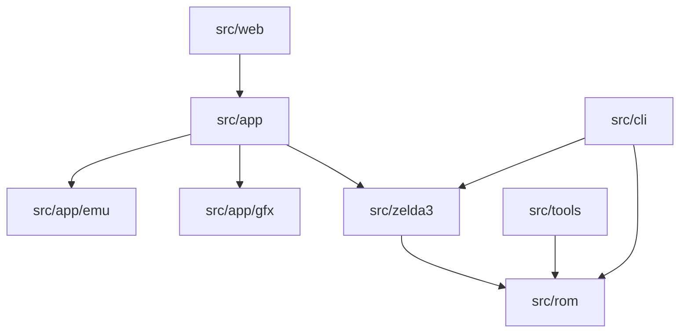

# E2 - Development Guide

This guide summarizes the architecture and implementation standards used across the editor codebase.

## Editor Status (January 2026)

**Status rubric**:
- **Stable**: Core workflows function reliably; remaining TODOs are UX polish.
- **Beta**: Core workflows exist, but important features are incomplete or experimental.
- **Experimental**: WIP, flagged experimental in UI, or has major TODOs in core paths.

| Editor | State | Evidence |
|--------|-------|----------|
| Overworld | Stable | E2E coverage; TODOs for v3 settings UI and entity deletion. |
| Dungeon | Stable | E2E coverage; TODOs for usage tracker, selection preview, and rendering TODOs in `src/zelda3/dungeon`. |
| Message | Stable | TODO: replace workflow in message editor. |
| Palette | Stable | TODO: JSON export/import and notifications. |
| Graphics | Beta | Explicit experimental section; screen editor marked WIP. |
| Sprite | Stable | Core sprite panels present; no WIP markers in editor code. |
| Screen | Experimental | `screen_editor.h` labeled WIP; title/inventory TODOs. |
| Emulator | Beta | Debug UI + PPU TODOs; save-state UI not fully wired. |
| Assembly | Beta | TODOs in assembly editor and project file editor. |
| Hex | Beta | Memory editor lacks search and richer UX; see `src/app/editor/code`. |
| Agent | Experimental | Chain mode labeled experimental; collaboration TODOs. |
| Music | Experimental | Sample import/export and BRR tooling TODOs; serialization incomplete. |
| Settings | Beta | Settings/project manager and layout serialization TODOs. |

For a cross-app status view (desktop/CLI/web), persistence notes, and test
coverage, see the [Feature & Test Coverage Report](../reference/feature-coverage-report.md).

### Recent Improvements (v0.3.9)

- **EditorManager Refactoring**: 90% feature parity with 44% code reduction
- **Panel-Based UI**: All 34 editor panels (formerly cards) with X-button close, multi-session support
- **SDL3 Backend Infrastructure**: 17 abstraction files for future migration
- **WASM Web Port**: Real-time collaboration via WebSocket
- **AI Agent Tools**: Phases 1-4 complete (meta-tools, schemas, validation)

### Known Issues

- **Dungeon object rendering**: Regression with object visibility
- **ZSOW v3 palettes**: Large-area palette issues being investigated

## Codebase Map

```text
yaze/
├── src/
│   ├── app/            # Desktop app (editors, gfx, emu, UI)
│   ├── zelda3/         # Domain data + ROM parsing (overworld, dungeon, music)
│   ├── rom/            # Core ROM container, transactions, diagnostics
│   ├── cli/            # z3ed CLI + agent tooling
│   ├── lab/            # Sandbox targets (layout designer, UI experiments)
│   ├── web/            # WASM UI + browser integration
│   ├── core/           # Shared core utilities/patch logic
│   └── util/           # Logging, file IO, helpers
├── incl/               # Public C API headers
├── test/               # Unit/integration/e2e/benchmarks
├── tools/              # Dev tools and build helpers
├── assets/             # Built-in assets (no ROMs)
├── cmake/              # Build system and dependency wiring
├── scripts/            # Automation helpers
└── docs/               # Documentation (public/internal)
```



## ROM Operations and Data Flow

- **Load**: `RomFileManager`/`SessionCoordinator` load ROMs into `Rom` and hydrate `zelda3::GameData`.
- **Read/Write**: `Rom` provides byte/word/long access; `Transaction` batches edits safely.
- **Domain parse**: `zelda3::*` modules interpret ROM data (overworld, dungeon rooms, sprites, music).
- **Edit**: Editors mutate domain models, then persist via save helpers (overworld, dungeon maps, palettes).
- **Patch/compare**: Asar wrapper, ROM diff tools, and doctor commands validate or patch data.
- **Test**: `TestRomManager` resolves ROMs locally; CI runs without ROMs and skips ROM-dependent suites.

## UX/UI Feature Map

- **Card-based layout**: EditorCardRegistry + LayoutManager for dockable panels and presets.
- **Session-aware UI**: Multi-session coordinator, per-editor panel visibility, activity bar.
- **Command tooling**: Command palette, shortcut manager, action registry.
- **Theming**: Shared palette + semantic color tokens via AgentUI theme helpers.
- **Agent UI**: Chat panels, tool execution, and multimodal test harnesses.
- **Layout designer**: WYSIWYG layout tooling for panel arrangements.

## Density Reduction Opportunities

- **Quarantine legacy ROM code**: `src/rom/rom_old.*` can move to a legacy target or be removed if unused.
- **Make WIP editors optional**: Gate agent UI and music editor behind build flags; layout designer now ships via the lab target.
- **Split editor system**: `yaze_editor_system_{panels,session,shortcuts}` targets now isolate editor system components.
- **Isolate experimental UI**: Layout designer now lives under `src/lab/` and builds via `YAZE_BUILD_LAB` (default OFF).
- **De-duplicate editor panels**: Consolidate shared panel patterns across dungeon/overworld/screen.
- **Reduce build surface**: Make emulator and web UI optional in minimal builds.

## 1. Core Architectural Patterns

These patterns, established during the Overworld Editor refactoring, should be applied to all new and existing editor components.

### Pattern 1: Modular Systems

**Principle**: Decompose large, monolithic editor classes into smaller, single-responsibility modules.

-   **Rendering**: All drawing logic should be extracted into dedicated `*Renderer` classes (e.g., `OverworldEntityRenderer`). The main editor class should delegate drawing calls, not implement them.
-   **UI Panels**: Complex UI panels should be managed by their own classes (e.g., `MapPropertiesSystem`), which then communicate with the parent editor via callbacks.
-   **Interaction**: Canvas interaction logic (mouse handling, editing modes) should be separated from the main editor class to simplify state management.

**Benefit**: Smaller, focused modules are easier to test, debug, and maintain. The main editor class becomes a coordinator, which is a much cleaner architecture.

### Pattern 2: Callback-Based Communication

**Principle**: Use `std::function` callbacks for child-to-parent communication to avoid circular dependencies.

-   **Implementation**: A parent editor provides its child components with callbacks (typically via a `SetCallbacks` method) during initialization. The child component invokes these callbacks to notify the parent of events or to request actions (like a refresh).
-   **Example**: `MapPropertiesSystem` receives a `RefreshCallback` from `OverworldEditor`. When a property is changed in the UI, it calls the function, allowing the `OverworldEditor` to execute the refresh logic without the `MapPropertiesSystem` needing to know anything about the editor itself.

### Pattern 3: Centralized Progressive Loading via `gfx::Arena`

**Principle**: All expensive asset loading operations must be performed asynchronously to prevent UI freezes. The `gfx::Arena` singleton provides a centralized, priority-based system for this.

-   **How it Works**:
    1.  **Queue**: Instead of loading a texture directly, queue it with the arena: `gfx::Arena::Get().QueueDeferredTexture(bitmap, priority);`
    2.  **Prioritize**: Assign a numerical priority. Lower numbers are higher priority. Use a high priority for assets the user is currently viewing and a low priority for assets that can be loaded in the background.
    3.  **Process**: In the main `Update()` loop of an editor, process a small batch of textures each frame: `auto batch = gfx::Arena::Get().GetNextDeferredTextureBatch(4, 2);` (e.g., 4 high-priority, 2 low-priority).
-   **Benefit**: This provides a globally consistent, non-blocking loading mechanism that is available to all editors and ensures the UI remains responsive.

## 2. UI & Theming System

To ensure a consistent and polished look and feel, all new UI components must adhere to the established theme and helper function system.

### 2.1. The Theme System (`AgentUITheme`)

-   **Principle**: **Never use hardcoded colors (`ImVec4`)**. All UI colors must be derived from the central theme.
-   **Implementation**: The `AgentUITheme` system (`src/app/editor/agent/agent_ui_theme.h`) provides a struct of semantic color names (e.g., `panel_bg_color`, `status_success`, `provider_ollama`). These colors are automatically derived from the application's current `ThemeManager`.
-   **Usage**: Fetch the theme at the beginning of a draw call and use the semantic colors:

    ```cpp
    const auto& theme = AgentUI::GetTheme();
    ImGui::PushStyleColor(ImGuiCol_ChildBg, theme.panel_bg_color);
    ```

### 2.2. Reusable UI Helper Functions

-   **Principle**: Encapsulate common UI patterns into helper functions to reduce boilerplate and ensure consistency.
-   **Available Helpers** (in `AgentUI` and `gui` namespaces):
    -   **Panels**: `AgentUI::PushPanelStyle()` / `PopPanelStyle()`
    -   **Headers**: `AgentUI::RenderSectionHeader(icon, label, color)`
    -   **Indicators**: `AgentUI::RenderStatusIndicator()` (status dot), `AgentUI::StatusBadge()` (colored text badge).
    -   **Buttons**: `AgentUI::StyledButton()`, `AgentUI::IconButton()`.
    -   **Layout**: `AgentUI::VerticalSpacing()`, `AgentUI::HorizontalSpacing()`.
-   **Benefit**: Creates a consistent visual language and makes the UI code far more readable and maintainable.

### 2.3. Toolbar Implementation (`CompactToolbar`)

- **Stretching**: To prevent ImGui from stretching the last item in a toolbar, do not use `ImGui::BeginGroup()`. Instead, manage layout with `ImGui::SameLine()` and end the toolbar with `ImGui::NewLine()`.
- **Separators**: Use `ImGui::SeparatorEx(ImGuiSeparatorFlags_Vertical)` for vertical separators that do not affect item layout.
- **Property Inputs**: Use the `toolbar.AddProperty()` method for consistent spacing and sizing of input fields within the toolbar.

## 3. Key System Implementations & Gotchas

### 3.1. Graphics Refresh Logic

-   **Immediate vs. Deferred**: When a visual property changes, the texture must be updated on the GPU immediately. Use `Renderer::Get().RenderBitmap()` for an immediate, blocking update. `UpdateBitmap()` is deferred and should not be used for changes the user expects to see instantly.
-   **Call Order is Critical**: When a property affecting graphics is changed, the correct sequence of operations is crucial:
    1.  Update the property in the data model.
    2.  Call the relevant `Load*()` method (e.g., `map.LoadAreaGraphics()`) to load the new data from the ROM into memory.
    3.  Force a redraw/re-render of the bitmap.

### 3.2. Multi-Area Map Configuration

-   **Use the Helper**: When changing a map's area size (e.g., from `Small` to `Large`), you **must** use the `zelda3::Overworld::ConfigureMultiAreaMap()` method. Do not set the `area_size` property directly.
-   **Why**: This method correctly handles the complex logic of assigning parent IDs to all sibling maps and updating the necessary ROM data for persistence. Failure to use it will result in inconsistent state and refresh bugs.

### 3.3. Version-Specific Feature Gating

-   **Principle**: The UI must adapt to the features supported by the loaded ROM. Do not show UI for features that are not available.
-   **Implementation**: Check the ROM's `asm_version` byte before rendering a UI component. If the feature is not supported, display a helpful message (e.g., "This feature requires ZSCustomOverworld v3+") instead of the UI.

### 3.4. Entity Visibility for Visual Testing

-   **Standard**: All overworld entity markers (entrances, exits, items, sprites) should be rendered with a high-contrast color and an alpha of `0.85f` to ensure they are clearly visible against any background.
    - **Entrances**: Bright yellow-gold
    - **Exits**: Cyan-white
    - **Items**: Bright red
    - **Sprites**: Bright magenta

## 4. Clang Tooling Configuration

The repository ships curated `.clangd` and `.clang-tidy` files that mirror our
Google-style C++23 guidelines while accommodating ROM hacking patterns.

- `.clangd` consumes `build/compile_commands.json`, enumerates `src/`, `incl/`,
  `third_party/`, generated directories, and sets feature flags such as
  `YAZE_WITH_GRPC`, `YAZE_WITH_JSON`, and `Z3ED_AI` so IntelliSense matches the
  active preset.
- `.clang-tidy` enables the `clang-analyzer`, `performance`, `bugprone`,
  `readability`, `modernize`, `google`, and `abseil` suites, but relaxes common
  ROM hacking pain points (magic numbers, explicit integer sizing, C arrays,
  carefully scoped narrowing conversions).
- The `gfx::SnesColor` utilities intentionally return ImVec4 values in 0‑255
  space; rely on the helper converters instead of manual scaling to avoid
  precision loss.
- Regenerate the compilation database whenever you reconfigure: `cmake --preset
  mac-dbg` (or the platform equivalent) and ensure the file lives at
  `build/compile_commands.json`.
- Spot-check tooling with `clang-tidy path/to/file.cc -p build --quiet` or a
  batch run via presets before sending larger patches.

## 5. Debugging and Testing

### 5.1. Quick Debugging with Startup Flags

To accelerate your debugging workflow, use command-line flags to jump directly to specific editors and open relevant UI panels:

```bash
# Quick dungeon room testing
./yaze --rom_file=zelda3.sfc --editor=Dungeon --open_panels="Room 0"

# Compare multiple rooms
./yaze --rom_file=zelda3.sfc --editor=Dungeon --open_panels="Room 0,Room 1,Room 105"

# Full dungeon workspace
./yaze --rom_file=zelda3.sfc --editor=Dungeon \
  --open_panels="Rooms List,Room Matrix,Object Editor,Palette Editor"

# Enable debug logging
./yaze --debug --log_file=debug.log --rom_file=zelda3.sfc --editor=Dungeon
```

**Available Editors**: Assembly, Dungeon, Graphics, Music, Overworld, Palette, Screen, Sprite, Message, Hex, Agent, Settings

**Dungeon Editor Panels**: Rooms List, Room Matrix, Entrances List, Room Graphics, Object Editor, Palette Editor, Room N (where N is room ID 0-319)

See [Startup Debugging Flags](debug-flags.md) for complete documentation, including panel visibility overrides (`--startup_welcome/--startup_dashboard/--startup_sidebar`).

### 5.2. Testing Strategies

For a comprehensive overview of debugging tools and testing strategies, including how to use the logging framework, command-line test runners, and the GUI automation harness for AI agents, please refer to the [Debugging and Testing Guide](debugging-guide.md).


## 5. Command-Line Flag Standardization

**Decision**: All binaries in the yaze project (`yaze`, `z3ed`, `yaze_test`, etc.) will standardize on the **Abseil Flags** library for command-line argument parsing.

### Rationale
- **Consistency**: Provides a single, consistent flag system and user experience across all tools.
- **Industry Standard**: Abseil is a battle-tested and well-documented library used extensively by Google.
- **Features**: It provides robust features out-of-the-box, including automatic `--help` generation, type safety, validation, and `--flagfile` support.
- **Reduced Maintenance**: Eliminates the need to maintain multiple custom flag parsers, reducing the project's technical debt.
- **Existing Dependency**: Abseil is already included as a dependency via gRPC, so this adds no new third-party code.

### Migration Plan
The project will migrate away from the legacy `yaze::util::Flag` system and manual parsing in phases. All new flags should be implemented using `ABSL_FLAG`.

- **Phase 1 (Complete)**: `z3ed` and `yaze_emu_test` already use Abseil flags.
- **Phase 2 (In Progress)**: The main `yaze` application will be migrated from the custom `util::Flag` system to Abseil flags.
- **Phase 3 (Future)**: The `yaze_test` runner's manual argument parsing will be replaced with Abseil flags.
- **Phase 4 (Cleanup)**: The legacy `util::flag` source files will be removed from the project.

Developers should refer to the Abseil Flags Guide for documentation on defining, declaring, and accessing flags.

---

When working with bitmaps and textures, understand that two memory locations must stay synchronized:

1. **`data_` vector**: C++ std::vector<uint8_t> holding pixel data
2. **`surface_->pixels`**: SDL surface's raw pixel buffer (used for texture creation)

**Critical Rules**:
- Use `set_data()` for bulk data replacement (syncs both vector and surface)
- Use `WriteToPixel()` for single-pixel modifications
- Never assign directly to `mutable_data()` for replacements (only updates vector, not surface)
- Always call `ProcessTextureQueue()` every frame to process pending texture operations

**Example**:
```cpp
// WRONG - only updates vector
bitmap.mutable_data() = new_data;

// CORRECT - updates both vector and SDL surface
bitmap.set_data(new_data);
```

### 3.6. Graphics Sheet Management

Graphics sheets (223 total) are managed centrally by `gfx::Arena`. When modifying a sheet:

1. Modify the sheet: `auto& sheet = Arena::Get().mutable_gfx_sheet(index);`
2. Notify Arena: `Arena::Get().NotifySheetModified(index);`
3. Changes automatically propagate to all editors

Default palettes are applied during ROM loading based on sheet index:
- Sheets 0-112: Dungeon main palettes
- Sheets 113-127: Sprite palettes
- Sheets 128-222: HUD/menu palettes

### Naming Conventions
- Load: Reading data from ROM into memory
- Render: Processing graphics data into bitmaps/textures (CPU pixel operations)
- Draw: Displaying textures/shapes on canvas via ImGui (GPU rendering)
- Update: UI state changes, property updates, input handling
