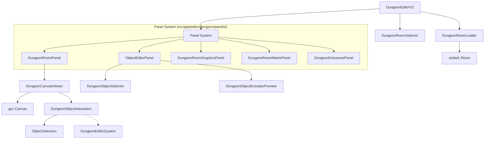

# Dungeon Editor Module (`src/app/editor/dungeon`)

This directory contains the components for the **Dungeon Editor** (V2), a comprehensive tool for editing `The Legend of Zelda: A Link to the Past` dungeon rooms. It uses a component-based architecture to separate UI, rendering, interaction, and data management.

## Architecture Overview

The editor is built around `DungeonEditorV2`, which acts as a coordinator for various **Panels** and **Components**. Unlike the monolithic V1 editor, V2 uses a docking panel system managed by `PanelManager`.

## Key Components

### Core Editor
*   **`dungeon_editor_v2.cc/h`**: The main entry point. Initializes the `PanelManager`, manages the `Rom` context, and instantiates the various panels. It maintains the list of active (open) rooms (`room_viewers_`).
*   **`dungeon_room_loader.cc/h`**: Handles I/O operations with the ROM. Responsible for parsing room headers, object lists, and calculating room sizes. Supports lazy loading.

### Rendering & Interaction
*   **`dungeon_canvas_viewer.cc/h`**: The primary renderer for a dungeon room. It draws the background layers (BG1, BG2, BG3), grid, and overlays. It delegates input handling to `DungeonObjectInteraction`.
*   **`dungeon_object_interaction.cc/h`**: Manages mouse input on the canvas. Handles:
    *   **Selection**: Click (single), Shift+Click (add), Ctrl+Click (toggle), Drag (rectangle).
    *   **Manipulation**: Drag-to-move, Scroll-to-resize.
    *   **Placement**: Placing new objects from the `ObjectEditorPanel`.
*   **Context Menu Integration**: `DungeonCanvasViewer` registers editor-specific actions with `gui::Canvas` so the right-click menu is unified across panels. Object actions (Cut/Copy/Paste/Duplicate/Delete/Cancel Placement) are always visible but automatically disabled when they do not apply, eliminating the old per-interaction popup.
*   **`object_selection.cc/h`**: A specialized class that holds the state of selected objects and implements selection logic (sets of indices, rectangle intersection). It is decoupled from the UI to allow for easier testing.

### Object Management
*   **`dungeon_object_selector.cc/h`**: The UI component for browsing the object library. It includes the "Static Object Editor" (opened via double-click) to inspect object draw routines.
*   **`panels/object_editor_panel.cc/h`**: A complex panel that aggregates `DungeonObjectSelector`, `DungeonObjectEmulatorPreview`, and template controls. It synchronizes with the currently active `DungeonCanvasViewer`.

### UI Components (Panels)
Located in `src/app/editor/dungeon/panels/`:
*   **`dungeon_room_panel.h`**: Container for a `DungeonCanvasViewer` representing a single open room.
*   **`dungeon_room_matrix_panel.h`**: A visual 16x19 grid for quick room navigation.
*   **`dungeon_room_graphics_panel.h`**: Displays the graphics blockset (tiles) used by the current room.
*   **`dungeon_entrances_panel.h`**: Editor for dungeon entrance properties (positions, camera triggers).

## Key Connections & Dependencies

*   **`zelda3/dungeon/`**: The core logic library. The editor relies heavily on `zelda3::Room`, `zelda3::RoomObject`, and `zelda3::DungeonEditorSystem` for data structures and business logic.
*   **`app/gfx/`**: Used for rendering backends (`IRenderer`), texture management (`Arena`), and palette handling (`SnesPalette`).
*   **`app/editor/system/panel_manager.h`**: The V2 editor relies on this system for layout and window management.

## Code Analysis & Areas for Improvement

### 1. Object Dimension Logic Redundancy
There are multiple implementations for calculating the visual bounds of an object:
*   `DungeonObjectInteraction::CalculateObjectBounds` (uses `ObjectDrawer` if available, falls back to naive logic)
*   `DungeonObjectSelector::CalculateObjectDimensions` (naive logic)
*   `ObjectSelection::GetObjectBounds` (uses `ObjectDimensionTable`)

**Recommendation**: Centralize all dimension calculation in `zelda3::ObjectDimensionTable` or a shared static utility in the editor namespace to ensure hit-testing matches rendering.

### 2. Legacy Methods in Interaction
`DungeonObjectInteraction` contains several methods marked as legacy or delegated to `ObjectSelection` (e.g., `SelectObjectsInRect`, `UpdateSelectedObjects`).
**Recommendation**: These should be removed to clean up the API once full integration is confirmed.

### 3. "Selector" vs "Interaction" Naming
*   `DungeonObjectSelector`: The *library* or *palette* of objects to pick from.
*   `ObjectSelection`: The *state* of objects currently selected in the room.
*   This naming collision can be confusing. Renaming `DungeonObjectSelector` to `DungeonObjectLibrary` or `ObjectBrowser` might clarify intent.

### 4. Render Mode Confusion
`DungeonCanvasViewer` supports an `ObjectRenderMode` (Manual, Emulator, Hybrid), but the `ObjectEditorPanel` also maintains its own `DungeonObjectEmulatorPreview`.
**Recommendation**: Clarify if the main canvas should ever use emulator rendering (slow but accurate) or if that should remain exclusive to the preview panel.

## Integration Guide

To add a new panel to the Dungeon Editor:
1.  Create a new class inheriting from `EditorPanel` in `src/app/editor/dungeon/panels/`.
2.  Implement `GetId()`, `GetDisplayName()`, and `Draw()`.
3.  Register the panel in `DungeonEditorV2::Initialize` using `panel_manager->RegisterPanel` or `RegisterEditorPanel`.
