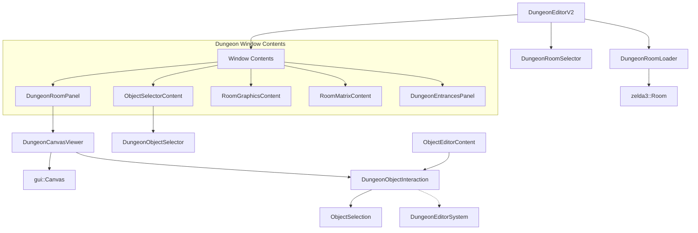

# Dungeon Editor Module (`src/app/editor/dungeon`)

This directory contains the components for the **Dungeon Editor** (V2), a comprehensive tool for editing `The Legend of Zelda: A Link to the Past` dungeon rooms. It uses a component-based architecture to separate UI, rendering, interaction, and data management.

## Architecture Overview

The editor is built around `DungeonEditorV2`, which acts as a coordinator for various **WindowContents** and **Components**. Unlike the monolithic V1 editor, V2 uses a docking window-content system managed by `WorkspaceWindowManager`.

```mermaid
graph TD
    Editor[DungeonEditorV2] --> Loader[DungeonRoomLoader]
    Editor --> Selector[DungeonRoomSelector]
    Editor --> Contents[Window Contents]

    subgraph "Dungeon Window Contents"
        Contents --> RoomPanel[DungeonRoomPanel]
        Contents --> SelectorContent[ObjectSelectorContent]
        Contents --> GraphicsContent[RoomGraphicsContent]
        Contents --> MatrixContent[RoomMatrixContent]
        Contents --> EntranceContent[DungeonEntrancesPanel]
    end

    RoomPanel --> Viewer[DungeonCanvasViewer]
    Viewer --> Canvas[gui::Canvas]
    Viewer --> Interaction[DungeonObjectInteraction]

    Interaction --> Selection[ObjectSelection]
    Interaction -.-> System[DungeonEditorSystem]

    SelectorContent --> ObjSelector[DungeonObjectSelector]
    EditorContent[ObjectEditorContent] --> Interaction

    Loader --> RomData[zelda3::Room]
```

## Key Components

### Core Editor
*   **`dungeon_editor_v2.cc/h`**: The main entry point. Initializes the `WorkspaceWindowManager`, manages the `Rom` context, and instantiates the various window contents. It maintains the list of active (open) rooms (`room_viewers_`).
*   **`dungeon_room_loader.cc/h`**: Handles I/O operations with the ROM. Responsible for parsing room headers, object lists, and calculating room sizes. Supports lazy loading.

### Rendering & Interaction
*   **`dungeon_canvas_viewer.cc/h`**: The primary renderer for a dungeon room. It draws the background layers (BG1, BG2, BG3), grid, and overlays. It delegates input handling to `DungeonObjectInteraction`.
*   **`dungeon_object_interaction.cc/h`**: Manages mouse input on the canvas. Handles:
    *   **Selection**: Click (single), Shift+Click (add), Ctrl+Click (toggle), Drag (rectangle).
    *   **Manipulation**: Drag-to-move, Scroll-to-resize.
    *   **Placement**: Placing new objects from the `ObjectSelectorContent`.
*   **Context Menu Integration**: `DungeonCanvasViewer` registers editor-specific actions with `gui::Canvas` so the right-click menu is unified across panels. Object actions (Cut/Copy/Paste/Duplicate/Delete/Cancel Placement) are always visible but automatically disabled when they do not apply, eliminating the old per-interaction popup.
*   **`object_selection.cc/h`**: A specialized class that holds the state of selected objects and implements selection logic (sets of indices, rectangle intersection). It is decoupled from the UI to allow for easier testing.

### Object Management
*   **`dungeon_object_selector.cc/h`**: The UI component for browsing the object library and choosing objects to place.
*   **`selectors/object_selector_content.cc/h`**: The browse/place window content for dungeon objects. It keeps selection editing out of the selector and synchronizes placement with the active `DungeonCanvasViewer`.
*   **`inspectors/object_editor_content.cc/h`**: The selected-object inspector for single-selection and multi-selection room object editing.
*   **`ui/window/object_tile_editor_panel.{h,cc}`**: Visual 8x8 tile-composition editor for dungeon objects. It captures layouts through `zelda3::ObjectTileEditor`, keeps preview and atlas bitmaps in sync with the active palette, re-renders the room after apply, and is covered by focused panel/backend tests.

### UI Components (WindowContents)
Located across role-based folders under `src/app/editor/dungeon/`:
*   **`ui/window/dungeon_room_panel.h`**: Container for a `DungeonCanvasViewer` representing a single open room.
*   **`workspace/room_matrix_content.h`**: A visual 16x19 grid for quick room navigation.
*   **`workspace/room_graphics_content.h`**: Displays the graphics blockset (tiles) used by the current room.
*   **`ui/window/dungeon_entrances_panel.h`**: Editor for dungeon entrance properties (positions, camera triggers).

## Key Connections & Dependencies

*   **`zelda3/dungeon/`**: The core logic library. The editor relies heavily on `zelda3::Room`, `zelda3::RoomObject`, and `zelda3::DungeonEditorSystem` for data structures and business logic.
    *   `DungeonEditorSystem` now handles full-room persistence for objects, sprites, headers, torches, collision, chests, and pot items for managed or external rooms.
*   **`app/gfx/`**: Used for rendering backends (`IRenderer`), texture management (`Arena`), and palette handling (`SnesPalette`).
*   **`app/editor/system/workspace/workspace_window_manager.h`**: The V2 editor relies on this system for layout and window management.

## Code Analysis & Areas for Improvement

### 1. Object Dimension Logic — Centralized in `zelda3::DimensionService`
All editor-side bound/dimension queries delegate to `zelda3::DimensionService::Get()`:

| Caller | Accessor |
|---|---|
| `DungeonObjectInteraction::CalculateObjectBounds` | `GetPixelDimensions` |
| `DungeonObjectSelector::CalculateObjectDimensions` | `GetPixelDimensions` (clamped to 256) |
| `TileObjectHandler::CalculateObjectBounds` | `GetPixelDimensions` |
| `ObjectSelection::GetObjectBounds` | `GetHitTestBounds` |

`DimensionService` tries `ObjectGeometry` (exact buffer replay) first and falls back to `ObjectDimensionTable` (hardcoded estimates). Covered by `test/unit/zelda3/dungeon/dimension_service_test.cc` + `dimension_cross_validation_test.cc`. Do not reintroduce per-caller dimension switches — add coverage to the service instead.

### 2. Legacy Methods in Interaction
`DungeonObjectInteraction` contains several methods marked as legacy or delegated to `ObjectSelection` (e.g., `SelectObjectsInRect`, `UpdateSelectedObjects`).
**Recommendation**: These should be removed to clean up the API once full integration is confirmed.

### 3. "Selector" vs "Interaction" Naming
*   `DungeonObjectSelector`: The *library* or *palette* of objects to pick from.
*   `ObjectSelection`: The *state* of objects currently selected in the room.
*   This naming collision can be confusing. Renaming `DungeonObjectSelector` to `DungeonObjectLibrary` or `ObjectBrowser` might clarify intent.

### 4. Render Mode Confusion
`DungeonCanvasViewer` supports an `ObjectRenderMode` (Manual, Emulator, Hybrid), while selector previews still rely on separate preview-generation paths.
**Recommendation**: Keep placement browsing lightweight and drive parity investigations from the room canvas plus issue reports instead of reviving embedded preview/editor flows in the selector.

## Integration Guide

To add a new window content to the Dungeon Editor:
1.  Create a new class inheriting from `WindowContent` in the appropriate role-based folder under `src/app/editor/dungeon/`.
2.  Implement `GetId()`, `GetDisplayName()`, and `Draw()`.
3.  Register the panel in `DungeonEditorV2::Initialize` using `window_manager->RegisterPanel` or `RegisterWindowContent`.
