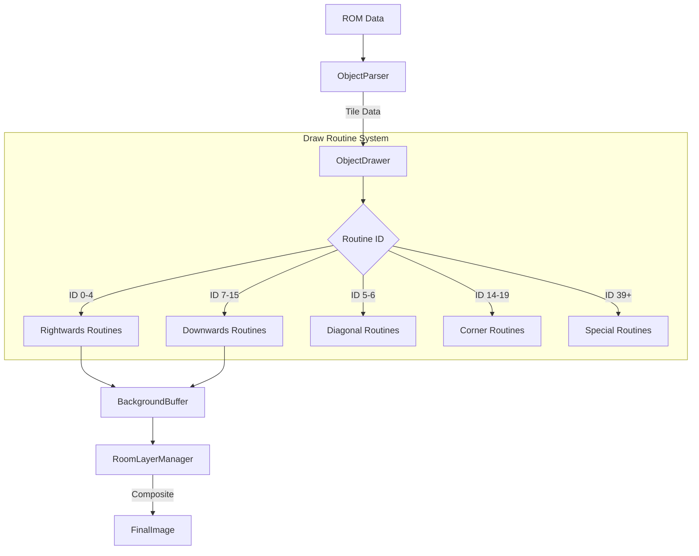

# Zelda3 Dungeon Core Module (`src/zelda3/dungeon`)

This directory contains the core business logic, data structures, and rendering algorithms for the `The Legend of Zelda: A Link to the Past` dungeon system. It serves as the backend for the editor UI found in `src/app/editor/dungeon`.

## Current Status (January 2026)

**Core System: Stable** - 222/222 unit and integration tests passing.

The object rendering pipeline has been validated against the ALTTP disassembly:
- Type 1/2/3 object detection and parsing ✅
- Index calculation for all object tables ✅
- Draw routine mapping (130+ routines) ✅
- BothBG flag propagation ✅
- Tile count lookup tables ✅

**Known Minor Issues**: Some specific objects (vertical rails, doors, certain edge patterns) may have visual discrepancies that require individual verification against the game. These are not regressions but areas needing refinement.

## Architecture Overview

The module is designed to replicate the SNES game engine's logic for loading, parsing, and rendering dungeon rooms, while providing high-level editing capabilities.

### Core Domain Entities

*   **`Room`**: The aggregate root representing a single dungeon room (IDs 0-295). It manages:
    *   **`RoomObject`** list (walls, floors, interactables).
    *   **`Sprite`** list (enemies, NPCs).
    *   **Header data** (collision, palette, blockset).
    *   **State** (chests, doors, etc.).
*   **`RoomObject`**: Represents a tile-based object. It handles the complex bit-packing of the three object subtypes used by the SNES engine:
    *   **Type 1** (0x00-0xFF): Standard scalable objects.
    *   **Type 2** (0x100-0x1FF): Complex/Preset objects.
    *   **Type 3** (0xF80-0xFFF): Special objects and paths.
*   **`RoomLayout`**: Represents the structural layout of a room (walls and floor) separately from the mutable object list.

### The Rendering Pipeline

This module implements a faithful recreation of the ALTTP dungeon rendering engine to ensure what you see in the editor matches the game.

*   **`ObjectParser`**: Reads raw tile data directly from the ROM's graphics banks based on object IDs.
*   **`ObjectDrawer`**: The core rendering engine. It maps Object IDs to specific "Draw Routines".
*   **`draw_routines/`**: A collection of pure functions that mirror the ASM routines from `bank_01.asm`. They calculate tile positions based on object size and orientation.
    *   *Example*: `DrawRightwards2x2_1to15or32` draws a 2x2 block repeated N times horizontally.

### Editing Subsystems

*   **`DungeonEditorSystem`**: The high-level facade for the application layer. It manages the editing session, undo/redo history, and coordination between different editing modes (Objects, Sprites, Entrances).
*   **`DungeonObjectEditor`**: Specialized logic for manipulating `RoomObject` entities (Insert, Delete, Move, Resize). Handles grid snapping and collision checks.
*   **`ObjectDimensionTable`**: Provides hit-testing bounds for objects. This is distinct from the visual rendering size and is derived from ROM data tables.
*   **`ObjectTemplateManager`**: Allows creating and instantiating groups of objects (templates).

## Key Files & Components

### Data & State
*   **`dungeon_rom_addresses.h`**: Central registry of ROM memory offsets.
*   **`dungeon_state.h` / `editor_dungeon_state.h`**: Abstracts game state (e.g., "Is chest X open?") to allow the editor to simulate different gameplay scenarios.
*   **`room_entrance.h`**: Defines entrance/exit data structures.

### Rendering
*   **`room_layer_manager.h`**: Controls the visibility and blending of the SNES background layers (BG1, BG2, BG3). Handles complex "Layer Merge" logic used in the game.
*   **`palette_debug.cc/h`**: Instrumentation tools for diagnosing palette loading and application issues.

### Logic
*   **`dungeon_validator.cc/h`**: Enforces game limits (e.g., max sprites per room, max chests).
*   **`dungeon_object_registry.cc/h`**: A registry for object names and metadata.

## Comparison: Backend vs. Frontend

| Feature | `src/zelda3/dungeon` (Backend) | `src/app/editor/dungeon` (Frontend) |
| :--- | :--- | :--- |
| **Focus** | Logic, Data, Rendering Algorithms | UI, Input, State Coordination |
| **Dependencies** | `rom/`, `app/gfx/` (Base types) | `zelda3/dungeon`, `imgui` |
| **Rendering** | Draws tiles to memory buffers | Displays buffers on Canvas, handles Pan/Zoom |
| **Input** | N/A | Handles Mouse/Keyboard events |
| **State** | Holds the "Truth" (Room data) | Manages Selection state, Tool modes |

## Areas for Improvement

1.  **Unified Dimension Logic**:
    Currently, `ObjectDimensionTable` (hitboxes) and `draw_routines` (visuals) maintain separate logic for object sizes. This can lead to desyncs where the click area doesn't match the drawn object.
    *Action*: Consolidate logic so `ObjectDimensionTable` queries the draw routines or vice-versa.

2.  **Hardcoded ROM Offsets**:
    `dungeon_rom_addresses.h` contains hardcoded offsets for the US ROM.
    *Action*: Move these to a version-aware configuration system to support JP/EU ROMs.

3.  **Sprite Rendering**:
    While `RoomObject` rendering is highly advanced, `Sprite` rendering is currently rudimentary (simple boxes in some views).
    *Action*: Implement a `SpriteDrawer` similar to `ObjectDrawer` using the game's sprite OAM tables.

4.  **Legacy Code**:
    Some classes (e.g., in `room.cc`) contain legacy loading logic that might duplicate the newer `ObjectParser`.
    *Action*: Audit and deprecate old loading paths in favor of the robust parser.
